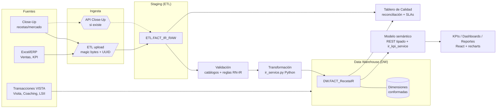

# VISTA — Diseño Funcional, Analítico y de Datos (Módulo IR + Capa Analítica)

> Documento de arquitectura. Fecha: 2026-07-22. Estado: **borrador para revisión del negocio**.
> Adecuación del prompt genérico de diseño BI a la realidad del sistema VISTA ya construido.
>
> **Convención de este documento:**
> ✅ = ya existe en el código · ⚠️ = existe parcial / a extender · ❌ = no existe (delta a construir)
> **⟦SUPUESTO⟧** = afirmación que asumimos y hay que confirmar · **⟦PREGUNTA⟧** = dato que falta del negocio.
> Nada marcado ✅ se re-especifica: se documenta como está en el código y se cita la tabla/clase real.

---

## 1. Resumen ejecutivo

VISTA es un sistema MIP de productividad y reconocimiento de la fuerza de ventas farmacéutica,
**ya en producción** (`vista-mip.com`), con 44 pantallas, ~32 dimensiones y 25 tablas de hecho,
ETL, RBAC/ABAC editable, auditoría y motor de cálculo 100% Python sobre PostgreSQL.

Este documento **no rediseña VISTA desde cero**. Su objeto es el **delta** entre lo que el prompt
pide y lo que el sistema ya tiene. Ese delta son **tres capacidades nuevas**:

1. **Módulo IR (Close-Up)** — hoy solo existe `FACT_EVOIR` agregado (rep×producto×ciclo, sin
   competencia). Se necesita un hecho de **recetas de grano fino** (médico×producto×territorio×período)
   alimentado desde Close-Up, con las dimensiones conformadas que faltan (Territorio, Fuente, Canal,
   Tipo de receta) y, si el negocio lo confirma, datos de **competencia** para participación de mercado.
2. **Capa analítica temporal / BI** — VISTA compara por ciclo (`FACT_TendenciaCiclo`, Consistencia de
   3 ciclos), pero **no** tiene el motor de comparación de calendario (MoM, YoY, QoQ, YTD, acumulados
   móviles, proyecciones). Es lo que convierte el dato IR en decisiones.
3. **Tablero de Calidad de Datos** — hay bitácora de cargas (`FACT_CargaExcel`) y auditoría, pero no
   un scorecard de calidad (reconciliación con la fuente, duplicados, cobertura de catálogos, SLAs).

**Riesgo #1 del proyecto:** todo el módulo IR depende de **cómo entrega Close-Up la información**
(formato, grano, frecuencia, si trae competencia). Ese dato **falta** y bloquea el diseño físico del
hecho de recetas (ver §16). Recomendación: cerrar la §16 con el negocio **antes** de construir.

---

## 2. Alcance y supuestos

### En alcance
- Diseño del **módulo IR** (ingesta Close-Up → staging → validación → hecho de recetas → analítica).
- Diseño de la **capa analítica temporal** (comparaciones de calendario, market share, rankings).
- Diseño del **tablero de calidad de datos**.
- Las **interfaces (UI)** que cada uno de los tres necesita.

### Fuera de alcance (ya existe, no se toca)
- Modelo dimensional base, ETL de KPIs, RBAC/ABAC, auditoría, y las 44 pantallas operativas
  (Dashboard, Productividad, Cobertura 4DX, Coaching, Categorización, Médicos/Maestro, Ranking,
  Reconocimiento, LSII, Exámenes, Visita, Reportes, Admin). Se **reutilizan** como dimensiones y
  fuentes; no se re-especifican.

### Supuestos
- **⟦SUPUESTO⟧** VISTA sigue siendo la edición PostgreSQL (única activa). Todo el diseño usa PG 17,
  esquemas `Config`/`DW`/`ETL`/`Audit`/`Security`, SQLAlchemy 2.0 y motor de cálculo en Python
  (sin stored procedures), coherente con la arquitectura actual.
- **CONFIRMADO (negocio, jul-2026)** — **No** hay acceso a la base de datos de Close-Up. La integración
  de recetas es contra una **base de datos intermedia que provee el cliente**: el cliente descarga su
  Close-Up en esa BD y **VISTA se conecta de solo lectura**. VISTA nunca habla con Close-Up directamente.
- **CONFIRMADO (negocio, jul-2026)** — Las otras dos integraciones externas son el **ERP del cliente**
  (ventas/cuota) y su **sistema de visita médica / SFA** (cobertura y visitas). Solo Exámenes y Coaching
  son transacciones internas de VISTA.
- **⟦SUPUESTO⟧** El DW se mantiene **dentro** de la BD `scgcpr` (esquema `DW` ampliado), no en infra
  externa. Justificación en §5 (volumen y operación no justifican DW/Data Lake aparte).
- **⟦SUPUESTO⟧** "Recetas" de Close-Up son **estimaciones de prescripción** (panel/proyección de
  mercado), no recetas físicas transaccionales. Esto define la granularidad y el manejo de historial.

### Bloqueos activos
- **La imagen del dashboard referida en el prompt no fue provista.** El punto 1 del prompt
  (clasificar módulos por el "recuadro rojo" = fuentes externas, vs. transacciones internas) **no se
  puede completar sin ella** sin inventar. El §3 la deja como matriz parametrizable y marca la
  clasificación por confirmar.

---

## 3. Mapa de módulos y fuentes

**Clasificación confirmada por el negocio (jul-2026).** El origen de cada indicador del score quedó
definido así (esto reemplaza la clasificación que dependía de la imagen del dashboard):

**Solo 2 de los 8 indicadores son transacciones internas de VISTA; los otros 6 vienen por integración
con sistemas del cliente.**

| Indicador del score | Fuente | Externo/Interno | Vía de integración |
|---|---|---|---|
| EVO_IR (evolución de recetas) | **Close-Up** | Externo 🔴 | **BD intermedia del cliente** (el cliente baja su Close-Up y VISTA se conecta de solo lectura) |
| VENTAS (ventas vs. cuota) | **ERP del cliente** | Externo 🔴 | API / vista BD / export del ERP |
| COB_MD_F1 (cobertura frecuencia 1) | **SFA / visita médica del cliente** | Externo 🔴 | API / vista BD / export del SFA |
| COB_MD_F2 (cobertura frecuencia 2) | SFA / visita médica del cliente | Externo 🔴 | ídem |
| PROM_DIARIO (promedio diario visitas) | SFA / visita médica del cliente | Externo 🔴 | ídem |
| COB_FARMACIAS (cobertura farmacias) | SFA / visita médica del cliente | Externo 🔴 | ídem |
| **EVAL_CONOCIMIENTOS (Exámenes)** | **VISTA** | **Interno** ✅ | Ninguna — transacción propia |
| **EVAL_COACHING (Coaching)** | **VISTA** | **Interno** ✅ | Ninguna — transacción propia |

> **Tres integraciones a construir**, una por sistema del cliente: (1) **BD intermedia Close-Up** →
> recetas; (2) **ERP** → ventas/cuota; (3) **SFA / visita médica** → cobertura y visitas.
> Ver el RFI al cliente: `docs/integracion/2026-07-22-RFI-cliente-integracion-fuentes.md`.

> **Tensión a confirmar (⟦PREGUNTA⟧ crítica):** VISTA ya tiene su **módulo de Visita propio** que
> captura visitas y calcula cobertura 4DX en vivo. El negocio indica que los indicadores de cobertura
> del *score* (F1/F2, promedio diario, farmacias) vienen del **SFA externo del cliente**. Hay que
> confirmar si esos KPIs se alimentan del **SFA externo**, del **módulo Visita de VISTA**, o de
> **ambos** (p. ej. Visita para lo operativo/4DX y SFA para el score oficial). No es contradicción
> necesaria: hoy el ETL `KPI_RM` ya alimenta esos indicadores del score por separado del módulo Visita.

---

## 4. Arquitectura funcional

### 4.1 Módulo IR — propósito, usuarios, procesos

**Propósito:** integrar, validar y explotar la estimación de recetas de Close-Up para medir evolución,
participación de mercado y efectividad promocional por médico, producto, representante y territorio.

| Aspecto | Detalle |
|---|---|
| **Usuarios** | Gerente de Productividad (carga/valida), Gerente de Marca/Producto (analiza su línea), Dir. Comercial/Presidencia (visión consolidada), Representante (**solo su territorio**, auto-scope por `rm_id` como el resto de VISTA), Analista de Datos (reconciliación/calidad) |
| **Entradas** | Archivo/API de Close-Up (§16), catálogos maestros de VISTA (médico, producto, rep, territorio, ciclo) |
| **Salidas** | Hecho de recetas validado, KPIs de recetas/market share/evolución, tableros, reportes exportables |
| **Reglas de negocio** | (RN-IR-1) Solo se recalcula/carga sobre **ciclo abierto** (guard `validar_ciclo_abierto` ya existente — reutilizar). (RN-IR-2) Toda fila de Close-Up debe **mapear** a médico, producto y territorio conocidos; lo que no mapea va a rechazos, no se descarta en silencio. (RN-IR-3) Correcciones sobre ciclos cerrados **no** se aplican (snapshot inmutable). (RN-IR-4) Market share exige el universo de mercado (competencia); sin él, se reporta solo evolución propia y se marca "market share no disponible". |

### 4.2 Dependencias entre módulos
- **IR → Cobertura/Visita:** el KPI de "conversión de visitas en recetas" cruza `FACT_Visita` (interno)
  con el hecho de recetas IR (externo) por médico×producto×período. Es la unión más valiosa y la que
  justifica tener ambos en el mismo DW.
- **IR → Score Integral:** hoy `FACT_EVOIR` alimenta el componente COMERCIAL del Score (`iup_service`).
  El nuevo hecho fino debe **agregar** al grano rep×ciclo para no romper ese contrato (ver §14, fase 3).
- **IR → Categorización:** el potencial real de un médico (recetas) puede retroalimentar el criterio
  "Potencial de Prescripción" del motor de categorización. **⟦PREGUNTA⟧** ¿se desea ese lazo?

---

## 5. Arquitectura técnica

**Recomendación: DW dentro de PostgreSQL (esquema `DW` ampliado) + staging en `ETL`, patrón ELT por
lotes.** Tres conectores de ingesta, uno por fuente del cliente. No se recomienda infra separada.

**Método elegido: API REST (pull) para TODA fuente externa** — decisión del negocio (jul-2026). VISTA
extrae de las APIs del cliente una vez por ciclo/mes, valida a staging y calcula. BD de solo lectura o
export de archivo quedan solo como **fallback** si un endpoint no pudiera existir. Contrato de las APIs:
`docs/integracion/2026-07-22-RFI-cliente-integracion-fuentes.md`.

**Cuatro conectores REST a construir** (un cliente HTTP por fuente + maestros):

| Conector | Fuente | Endpoints que consume | Alimenta indicadores | Destino staging |
|---|---|---|---|---|
| **Maestros** | Cliente | `/maestros/{medicos,productos,representantes,territorios,farmacias}` | (mapeo de códigos) | upsert en `Config.DIM_*` |
| **Recetas (IR)** | Close-Up (BD intermedia → API) | `/recetas` | EVO_IR (+ market share) | `ETL.FACT_IR_RAW` |
| **Ventas** | ERP | `/ventas`, `/cuotas` | VENTAS | `ETL.FACT_VENTAS_RAW` |
| **Visitas** | SFA | `/visitas`, `/target`, `/dias-habiles` | COB_MD_F1, COB_MD_F2, PROM_DIARIO, COB_FARMACIAS | `ETL.FACT_COBERTURA_RAW` — **si el score se alimenta del SFA y no del módulo Visita (§3, §16)** |

| Criterio | Decisión | Porqué |
|---|---|---|
| **Volumen** | PG único | El volumen de una fuerza de ventas media cabe holgado en PG. **⟦PREGUNTA⟧** filas/ciclo por fuente. |
| **Frecuencia** | ELT por lotes (mensual/ciclo) | Las tres fuentes publican periódicamente; no hay caso de tiempo real. |
| **Ingesta BD→BD** | 2º engine SQLAlchemy de solo lectura a la BD intermedia del cliente | Conexión programada por ciclo; VISTA lee, valida a staging, transforma. No acopla al OLTP del cliente. |
| **Ingesta archivo** | Reutiliza el ETL existente (magic bytes, UUID) | Fallback robusto ya probado si una fuente entrega export en vez de BD/API. |
| **Staging** | `ETL.FACT_*_RAW` por fuente (espejo de `FACT_KPI_RAW`) | Aísla crudo de validado; permite reproceso y reconciliación. |
| **Transformación** | Python (`ir_service.py`, etc.), como el resto del motor | Coherencia con "motor 100% Python". |
| **Modelo semántico** | Endpoints REST tipados + KPIs en `ir_kpi_service.py` | VISTA ya expone su semántica por API a React. |
| **Seguridad** | RBAC/ABAC existente + credenciales de las BD del cliente en `.env`/config | Se agregan recursos `ir.*` a la matriz editable; conexiones de solo lectura y por VPN/IP autorizada. |

**Alternativas descartadas:** acceso directo a Close-Up (no ofrecido — se usa la BD intermedia del
cliente); tiempo real/CDC (las fuentes son publish periódico); Data Lake / DW externo (sobredimensionado;
VISTA ya tiene gobierno, seguridad y operación).

---

## 6. Diagrama de integración

---

## 7. Matriz fuente–módulo–frecuencia–responsable

| Fuente | Alimenta | Método | Frecuencia | Responsable (owner) |
|---|---|---|---|---|
| Close-Up | Módulo IR (`FACT_RecetaIR`) | ETL archivo / API | Mensual o por ciclo ⟦PREGUNTA⟧ | Gerente de Productividad + Analista de Datos |
| ERP/Excel Ventas | `FACT_Ventas` | ETL archivo | ⟦PREGUNTA⟧ | ⟦PREGUNTA⟧ |
| KPI_RM Excel | `FACT_ResultadoIndicador` | ETL archivo | Por ciclo | Gerente de Productividad |
| VISTA (Visita/Coaching/LSII) | módulos internos | Transaccional | Tiempo real | Representantes / Gerentes |
| Motor Python | Score/Ranking/Reconocimiento | Recálculo | Al cerrar carga | Sistema |

> **⟦PREGUNTA⟧** Confirmar owners y SLAs formales por fuente (nombre del responsable de negocio).

---

## 8. Modelo dimensional

**Estrella, dimensiones conformadas.** Se **reutilizan** las dimensiones que ya existen y se agregan
solo las que faltan para IR.

### 8.1 Dimensiones — reutilizadas vs. nuevas

| Dimensión | Estado | Tabla real / acción |
|---|---|---|
| Tiempo (día/mes/trim/sem/año) | ⚠️ parcial | `DIM_Ciclo`+`DIM_Mes` existen; **falta `DIM_Fecha` (calendario diario)** para MoM/YoY/YTD → **nueva** |
| Médico | ✅ | `DIM_Medico` (dedup por país+nombre; ver Maestro de Médicos) |
| Especialidad | ✅ | `DIM_Especialidad` |
| Representante | ✅ | `DIM_RM` |
| Supervisor | ⚠️ | `DIM_Gerente` (`tipo=DISTRITO`); se usa como supervisor vía `DIM_RM.gerente` |
| Producto | ✅ | `DIM_Producto` (tiene `area_terapeutica`, `linea_id`) |
| Línea terapéutica | ✅ | `DIM_Linea` |
| **Marca** | ❌ | **No existe.** Hoy solo `area_terapeutica` (atributo) y `linea_id`. → **⟦PREGUNTA⟧** ¿Marca es un nivel real entre Producto y Línea? Si sí, **nueva `DIM_Marca`** + FK en `DIM_Producto` |
| **Territorio / Zona / Región** | ❌ | Solo texto libre en `DIM_RM.zona`/`DIM_Gerente.zona`. → **nueva `DIM_Territorio`** con jerarquía Territorio→Zona→Región→País |
| Cliente / Institución | ✅ | `DIM_CentroMedico` (+`DIM_Provincia`/`DIM_Municipio`) |
| **Canal** | ❌ | → **nueva `DIM_Canal`** (retail/institucional/PSP) **⟦PREGUNTA⟧** ¿qué canales aplican? |
| Ciclo promocional | ✅ | `DIM_Ciclo` |
| Grilla promocional | ✅ | `ParrillaPromocional` (módulo Visita) |
| **Fuente de información** | ❌ | → **nueva `DIM_FuenteInformacion`** (Close-Up, Interno, ERP) — clave para linaje |
| **Tipo de visita** | ⚠️ | atributos en `FactVisita`; formalizar `DIM_TipoVisita` si se requiere cruce |
| **Tipo de receta** | ❌ | → **nueva `DIM_TipoReceta`** (nueva/repetición, estimada/captada) **⟦PREGUNTA⟧** ¿Close-Up distingue? |

### 8.2 Tablas de hecho

| Hecho | Estado | Grano | Métricas | Aditividad |
|---|---|---|---|---|
| **`DW.FACT_RecetaIR`** | ❌ **nueva** | médico × producto × territorio × período × fuente | recetas_estimadas, recetas_captadas, recetas_mercado (competencia) | Aditiva en el tiempo/entidades; **market share = no aditiva** (ratio) |
| Visitas médicas | ✅ | `FACT_Visita` (rm×médico×fecha×ciclo) | conteos | Aditiva |
| Actividad promocional / Grilla | ✅ | Parrilla + Muestras | muestras, cumplimiento | Aditiva / % no aditivo |
| Cobertura y frecuencia | ✅ | 4DX en vivo | L, M, cobertura | cobertura = **semiaditiva** (no suma entre períodos) |
| Ventas | ⚠️ | `FACT_Ventas` (rep×ciclo) | ventas, cuota, %cumpl | ventas aditiva; % no aditivo |
| Objetivos y cuotas | ⚠️ | `DIM_MetaIndicador`/`DIM_ParametroCobertura` | metas | referencia |
| Resultados del representante | ✅ | `FACT_ScoreIntegralRM`/`FACT_RankingRM` | score, posición | posición no aditiva |
| Integración / control de calidad | ❌ **nueva** | por carga × regla | filas ok/rechazadas, %reconciliación | ver §11 |

### 8.3 Muchos-a-muchos, SCD y aditividad
- **M:N** médico↔representante (un médico puede ser visitado por varios reps por línea): **tabla puente
  `DIM_MedicoVisita`** ya existe (asignación por rep/línea). El hecho IR se relaciona al médico y al
  rep del territorio; el puente resuelve el reparto. **⟦PREGUNTA⟧** ¿las recetas de un médico se
  atribuyen al rep de su territorio, o se reparten entre varios?
- **SCD:** `DIM_Medico`, `DIM_RM`, `DIM_Territorio` deben ser **SCD Tipo 2** (si un médico cambia de
  territorio o un rep de zona, la historia de recetas no debe reescribirse). Hoy VISTA no versiona
  dimensiones → **decisión nueva**: agregar `vigente_desde/hasta/es_actual` a esas dims. Alternativa
  más barata: fijar territorio/rep como **snapshot en el propio hecho** (grano ya lo incluye).
  **Recomendación:** snapshot en el hecho para IR (más simple, suficiente para análisis histórico).
- **Semiaditivas:** cobertura, market share, posiciones de ranking → nunca sumar entre períodos;
  agregar por promedio/último/recalculado según el KPI (ver §10).

---

## 9. Diccionario de dimensiones y hechos (nuevas)

### `DW.FACT_RecetaIR`  *(a construir)*
| Campo | Tipo | Nota |
|---|---|---|
| id | BigInteger PK | |
| pais_codigo | FK `DIM_Pais.codigo` | scope multipaís |
| medico_id | FK `DIM_Medico.id` | |
| producto_id | FK `DIM_Producto.id` | |
| rep_id | FK `DIM_RM.id` | rep del territorio (snapshot) |
| territorio_id | FK `DIM_Territorio.id` | **nueva dim** |
| ciclo_id | FK `DIM_Ciclo.id` | |
| fecha_id | FK `DIM_Fecha.id` | **nueva dim** (para MoM/YoY) |
| fuente_id | FK `DIM_FuenteInformacion.id` | linaje |
| tipo_receta_id | FK `DIM_TipoReceta.id` | ⟦PREGUNTA⟧ |
| recetas_estimadas | Numeric(14,4) | métrica principal |
| recetas_captadas | Numeric(14,4) | si Close-Up las separa |
| recetas_mercado | Numeric(14,4) | universo (competencia) → market share |
| fuente_carga_id | FK `ETL.FACT_CargaExcel` | trazabilidad |
| fecha_carga | timestamptz | |

- **Granularidad:** una fila por médico×producto×territorio×período×fuente.
- **Frecuencia de actualización:** por ciclo/mes (según Close-Up).
- **Reglas de validación:** RN-IR-2 (mapeo obligatorio a catálogos), no negativos, período dentro del
  ciclo abierto, deduplicación por la clave de grano.
- **Manejo de historial:** ciclos cerrados inmutables; territorio/rep snapshoteados en el hecho.

*(Diccionario completo de `DIM_Territorio`, `DIM_Fecha`, `DIM_FuenteInformacion`, `DIM_Canal`,
`DIM_TipoReceta`, `DIM_Marca` — se detalla en el plan de implementación; estructura estándar
código/nombre/jerarquía/activo, coherente con las dims existentes.)*

---

## 10. Catálogo de KPIs (fórmula · granularidad · fuente · interpretación)

| KPI | Fórmula | Grano | Fuente | Interpretación |
|---|---|---|---|---|
| Recetas por médico/producto/rep | Σ recetas_estimadas | según corte | `FACT_RecetaIR` | volumen |
| Evolución de recetas | (actual − anterior) / anterior | producto×período | IR | crecimiento |
| **Participación de mercado** | recetas_propias / recetas_mercado | producto×territorio | IR (**requiere competencia**) | share; **no aditivo** |
| Crecimiento abs/% | actual − base ; % | cualquiera | IR | vs base |
| Cobertura médica | médicos con receta / médicos target | rep×ciclo | IR + `DIM_TargetMedico` | alcance |
| Frecuencia de visitas | visitas / médicos | rep×ciclo | `FACT_Visita` ✅ | intensidad |
| Productividad del rep | recetas / visitas | rep×ciclo | IR + Visita | eficiencia |
| **Conversión visita→receta** | médicos_con_receta / médicos_visitados | médico×producto | IR ∩ Visita | efectividad promocional |
| Cumplimiento objetivos | real / meta | rep/producto | IR + `DIM_MetaIndicador` | logro |
| Cumplimiento de grilla | cumplido / planeado | rep×línea | Parrilla ✅ | ejecución |
| Médicos nuevos/activos/inactivos/recuperados | conteo por transición de estado entre períodos | médico | IR (serie) | dinámica de panel |
| Ranking médicos/productos/reps | orden por métrica | según corte | IR/derivado | posición **no aditiva** |
| Variación vs presupuesto/objetivo/período previo | real − referencia | cualquiera | IR + metas | brecha |

### Comparaciones temporales (motor nuevo — §requiere `DIM_Fecha`)
MoM, MoM año anterior, QoQ, QoQ año anterior, semestre vs semestre, YoY, **YTD vs YTD**, acumulados
móviles (3/6/12), tendencia y proyección lineal simple. **Regla:** toda comparación se calcula sobre
períodos **cerrados y comparables**; los ciclos parciales se marcan "en curso" y no se proyectan sin
avisar (evita comparar un mes incompleto contra uno completo).

---

## 11. Controles de calidad y gobierno

**Criterios medibles de aceptación** (no se promete "100%"; se mide contra umbral):

| Dimensión de calidad | Métrica | Umbral de aceptación ⟦SUPUESTO, a validar⟧ |
|---|---|---|
| Integridad referencial | % filas con médico/producto/territorio mapeado | ≥ 99% |
| Completitud | % campos obligatorios no nulos | ≥ 99.5% |
| Unicidad | duplicados por clave de grano | = 0 |
| Consistencia | % dentro de rangos válidos (no negativos, período válido) | 100% |
| Reconciliación con fuente | |total VISTA − total Close-Up| / total | ≤ 0.5% |
| Oportunidad | carga dentro de la ventana del SLA | ≥ 95% de cargas |

**Mecanismos (varios ya existen en VISTA):** bitácora de cargas ✅ (`FACT_CargaExcel`), rechazos a
staging ❌ (nuevo `FACT_IR_RAW` con motivo de rechazo), alertas por correo ✅ (`notification_service`),
linaje ⚠️ (via `DIM_FuenteInformacion` + `fuente_carga_id`), reproceso ⚠️ (recarga idempotente por
clave). **Tablero de Calidad (nuevo):** semáforos por dimensión de calidad, tendencia de reconciliación,
top de motivos de rechazo, cargas fuera de SLA.

---

## 12. Modelo de seguridad

Se **reutiliza** el modelo RBAC/ABAC ya existente (no se rediseña):
- Matriz editable de 32 recursos × roles → **se agregan recursos `ir.consultar`, `ir.cargar`,
  `ir.calidad`** con acción/alcance (own/team/all).
- Auto-scope: Representante ve **solo su territorio** (`rm_id`), GD su equipo (`gerente_id`), como el
  resto de VISTA. Segregación de funciones: quien **carga** IR (Gerente Productividad) ≠ quien
  **aprueba** correcciones (⟦PREGUNTA⟧ ¿workflow de aprobación como Costo/ROI?).
- Auditoría ✅ (`FACT_Auditoria`, `FACT_AuditoriaSeguridad`), cifrado en tránsito ✅ (TLS Caddy/nginx),
  credenciales gestionadas fuera del código ✅ (`.env`, config SMTP en BD).
- **Pendiente/⟦PREGUNTA⟧:** cifrado en reposo (¿lo exige la norma aplicable?), política de retención de
  datos de Close-Up, respaldos (ya hay servicio de backup PG — confirmar RPO/RTO).

---

## 13. Riesgos y mitigaciones

| # | Riesgo | Impacto | Mitigación |
|---|---|---|---|
| R1 | Formato/grano de Close-Up desconocido | Bloquea el diseño físico de `FACT_RecetaIR` | Cerrar §16 antes de construir; diseñar staging tolerante a formato |
| R2 | Sin datos de competencia | Market share no calculable | Confirmar con Close-Up; si no, entregar solo evolución propia y marcarlo |
| R3 | Mapeo médico/producto/territorio incompleto | Recetas huérfanas | Reglas de rechazo + tablero de calidad + Maestro de Médicos ya robusto |
| R4 | Cambio de territorio/rep reescribe historia | Análisis histórico erróneo | Snapshot en el hecho (recomendado) o SCD2 |
| R5 | Romper el componente COMERCIAL del Score | Regresión en Ranking | Agregar IR fino → rep×ciclo conservando el contrato de `iup_service` (caracterización) |
| R6 | La imagen del dashboard nunca se aclara | Clasificación de módulos incompleta | Matriz parametrizable + confirmación puntual con negocio |

---

## 14. Plan de implementación por fases

- **Fase 0 — Cierre de incógnitas (negocio).** Responder §16. Sin esto no arranca IR. *(bloqueante)*
- **Fase 1 — Dimensiones que faltan.** `DIM_Fecha`, `DIM_Territorio`, `DIM_FuenteInformacion`,
  `DIM_Canal`, `DIM_TipoReceta` (+`DIM_Marca` si aplica). Migraciones + seed. *(base de todo)*
- **Fase 2 — Ingesta IR.** `ETL.FACT_IR_RAW` + `ir_service.py` (validación/mapeo/rechazos) +
  `DW.FACT_RecetaIR` + pantalla de carga/validación (patrón `ETL.tsx`). *(entrega dato confiable)*
- **Fase 3 — Puente al Score.** Agregar IR fino → rep×ciclo sin romper `iup_service` (caracterización).
- **Fase 4 — Capa analítica temporal.** `ir_kpi_service.py` con MoM/YoY/QoQ/YTD + endpoints tipados.
- **Fase 5 — Interfaces analíticas.** Dashboards IR (por médico/producto/rep/territorio) con
  comparaciones y rankings (React+recharts, patrón de dashboards existentes).
- **Fase 6 — Tablero de Calidad de Datos.** Scorecard + reconciliación + SLAs.
- **Fase 7 — Market share** (solo si R2 se resuelve con competencia).

Cada fase sigue el flujo del repo: brainstorming → spec → writing-plans → subagent-driven-development.

## 15. Prioridades, dependencias y esfuerzo (relativo)

| Fase | Prioridad | Depende de | Esfuerzo ⟦estimación gruesa, a refinar⟧ |
|---|---|---|---|
| 0 Incógnitas | 🔴 crítica | negocio | días (reuniones) |
| 1 Dimensiones | 🔴 alta | Fase 0 | S (bajo) |
| 2 Ingesta IR | 🔴 alta | Fase 1 | L (alto) — es el corazón |
| 3 Puente Score | 🟠 media | Fase 2 | M |
| 4 KPIs temporales | 🟠 media | Fase 1 (`DIM_Fecha`) | M |
| 5 Dashboards IR | 🟠 media | Fase 4 | L |
| 6 Tablero Calidad | 🟡 media-baja | Fase 2 | M |
| 7 Market share | 🟡 condicional | R2 resuelto | M |

## 16. Preguntas pendientes *(la mayoría van al cliente — ver RFI `docs/integracion/2026-07-22-RFI-cliente-integracion-fuentes.md`)*

**Confirmado ya (jul-2026):** origen de los 8 indicadores (§3); integración de recetas vía **BD
intermedia del cliente** (no Close-Up directo); ventas por **ERP**; cobertura por **SFA**.

**Al cliente / su TI (bloquean el diseño físico):**
1. **BD intermedia Close-Up:** ¿la exponen de solo lectura? ¿motor, conexión segura, frecuencia de
   descarga, quién la mantiene?
2. **Recetas — grano:** ¿por médico individual, o agregada (médico-producto-mes / territorio-producto-mes)?
   **Define el grano de `FACT_RecetaIR`.**
3. **Competencia / mercado:** ¿la data trae recetas del **mercado/competidores** (para market share) o
   solo los productos propios?
4. **Territorio:** jerarquía real (¿Territorio→Zona→Región→País?) y **cómo se codifica** en cada fuente
   para mapear a `DIM_RM`/`DIM_Territorio`.
5. **Códigos de mapeo:** ¿cómo identifican **médico, producto y representante** las tres fuentes
   (Close-Up-DB, ERP, SFA)? Es lo que permite cruzarlas.
6. **ERP — ventas:** ¿qué ERP, método (API/vista/export), grano (rep×producto×período), y de dónde sale
   la **cuota**?
7. **SFA — cobertura:** ¿qué sistema, método, grano de visita, definición de F1/F2 y del universo target?
8. **SLAs y contactos técnicos** por fuente; **norma de cumplimiento** (cifrado en reposo/retención).

**Decisiones internas (no dependen del cliente):**
9. **Cobertura del score: ¿SFA externo o módulo Visita de VISTA?** (la tensión de §3 — la más importante
   de resolver internamente, porque decide si se construye el conector SFA o se reusa lo interno).
10. **Marca:** ¿es un nivel distinto de Línea y Producto, o sinónimos? (decide si nace `DIM_Marca`).
11. **Atribución médico↔rep:** ¿recetas al rep del territorio, o repartidas entre varios que lo visitan?
12. **Tipo de receta:** ¿la data distingue nueva vs. repetición, estimada vs. captada?
13. **Lazo IR→Categorización:** ¿el potencial de prescripción se alimenta de recetas reales?
14. **Workflow de correcciones IR:** ¿aprobación de dos pasos (como Costo/ROI) o carga directa?
